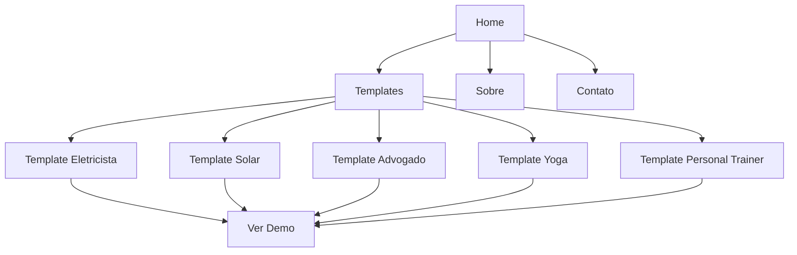

# Projeto: Site de Portfólio para Agência de Web Design

## 1. Visão Geral do Projeto

**Nome do Projeto:** Portfólio Agency Website  
**Tipo:** Site de portfólio multi-template com internacionalização  
**Objetivo:** Criar um site de portfólio profissional para uma agência de web design que apresente templates de landing pages e sites para diversos profissionais (eletricistas, painéis solares, advogados, professor de yoga, personal trainer, etc.)  
**Idioma Principal:** Português do Brasil (PT-BR)  
**Idiomas Adicionais:** Inglês (EN), Espanhol (ES) - com detecção automática por país

---

## 2. Estrutura do Site

### 2.1 Páginas Principais

| Página | Descrição |
|--------|-----------|
| **Home** | Apresentação da agência, serviços, diferenciais e chamada para ação |
| **Templates** | Galeria de todos os templates disponíveis com preview |
| **Template Individual** | Página de detalhes de cada template (várias) |
| **Sobre** | História da agência, equipe, valores |
| **Contato** | Formulário de contato e informações |

### 2.2 Templates de Sites a Criar

**Todos os templates são Frontend-only (sem backend)**

Cada template terá design único baseado na profissão:

| # | Template | Cor Principal | Estilo |
|---|----------|----------------|--------|
| 1 | **Eletricista** | #FFB800 (Amarelo eletricista) | Vibrante, moderno |
| 2 | **Painéis Solares** | #00AEEF (Azul céu) | Limpo, sustentável |
| 3 | **Advogado** | #1A365D (Azul marinho) | Sério, profissional |
| 4 | **Professor de Yoga** | #38A169 (Verde natureza) | Calmo, orgânico |
| 5 | **Personal Trainer** | #E53E3E (Vermelho energia) | Dinâmico, intenso |
| 6 | **Dentista** | #4299E1 (Azul干净) | Higiênico, confiável |
| 7 | **Veterinário** | #805AD5 (Roxo) | Amigável, cuidador |
| 8 | **Restaurante** | #DD6B20 (Laranja apetitoso) | Aconchegante, culinary |
| 9 | **Salão de Beleza** | #D69BC8 (Rosa elegante) | Elegante, sofisticado |
| 10 | **Arquiteto** | #2D3748 (Cinza escuro) | Moderno, arquitetural |
| 11 | **Fotógrafo** | #1A1A2E (Preto fosco) | Elegante, minimalista |
| 12 | **Contador** | #2B6CB0 (Azul conservador) | Confiável, formal |
| 13 | **Autoescola** | #ED8936 (Laranja) | Divertido, learning |
| 14 | **Clínica Médica** | #38B2AC (Teal médico) | Sério, clean |
| 15 | **Agência de Viagens** | #00B5D8 (Turquesa) | Aventura,-exótico |

---

## 3. Especificações Técnicas

### 3.1 Arquitetura

```
/index.html              # Página principal
/css/
  /styles.css           # Estilos principais
  /templates.css        # Estilos específicos dos templates
  /responsive.css       # Estilos responsivos
/js/
  /main.js              # Scripts principais
  /language.js          # Sistema de internacionalização
  /templates.js         # Dados dos templates
/assets/
  /images/              # Imagens do projeto
  /icons/               # Ícones
/templates/             # Páginas de demonstração dos templates
```

### 3.2 Sistema de Internacionalização

- **Detecção de País:** Usar API ipapi.co ou similar para detectar país
- **Idiomas:**
  - 🇧🇷 Português (Brasil) - Padrão
  - 🇺🇸 Inglês (EUA, Reino Unido, Canadá)
  - 🇪🇸 Espanhol (Espanha, México, Argentina, Colombia)
- **Fallback:** Se país não reconhecido, usar PT-BR
- **Switcher Manual:** Usuário pode trocar idioma manualmente

### 3.3 Design System

**Site Principal (Portfólio da Agência):**

**Tema:** Minimalista, Clean White/Light Gray

**Cores:**
- Primária: #FFFFFF (Branco)
- Secundária: #F5F5F5 (Cinza claro)
- Acento: #28A745 (Verde)
- Texto Principal: #333333 (Cinza escuro)
- Texto Secundário: #666666 (Cinza médio)
- Bordas: #E0E0E0 (Cinza suave)

**Tipografia:**
- Família Principal: Open Sans, Lato (Sans-serif)
- Títulos: Negrito, hierarquia clara
- Textos: Regular, boa legibilidade

**Layout:**
- Grid responsivo
- Componentes reutilizáveis
- Animações sutis
- Muito espaço em branco

**Nota:** Cada template de cliente terá seu próprio design único baseado na profissão (conforme tabela na seção 2.2)

---

## 4. Fluxo de Navegação



---

## 5. Funcionalidades Principais

### 5.1 Home Page
- Hero section com tagline e CTA
- Apresentação dos serviços
- Showcase de templates em destaque
- Depoimentos de clientes
- Blog/Últimos projetos
- Footer com informações de contato

### 5.2 Galeria de Templates
- Grid de templates com thumbnails
- Filtro por categoria
- Preview ao hover
- Botão para ver demonstração

### 5.3 Página de Template
- Preview completo do design
- Lista de funcionalidades incluídas
- Botão de contato para orçamento

### 5.4 Sistema de Idiomas
- Detecção automática por IP
- Selector de idioma manual
- Todas as páginas traduzidas
- URL com parâmetro de idioma (?lang=pt/en/es)

---

## 6. Diferenciais vs Hinger.digital

1. **Design Próprio:** Não copiar layout, criar identidade visual única
2. **Mais Templates:** Apresentar maior variedade inicial
3. **Interatividade:** Adicionar transições e animações mais sofisticadas
4. **Performance:** Otimizar para carregamento rápido
5. **Código Limpo:** Sem dependencies excessivas, código próprio
6. **Modernidade:** Usar técnicas mais atuais (CSS Grid, Flexbox, Custom Properties)

---

## 7. Stack Tecnológico

- **HTML5** - Semântica e estrutura
- **CSS3** - Estilos com variáveis, Flexbox, Grid
- **JavaScript Vanilla** - Funcionalidades (sem frameworks pesados)
- **APIs:**
  - Detecção de país por IP
  - Formulário de contato (simples)

**Nota:** Todos os templates são Frontend-only. O template de Restaurante inclui carrinho de compras que envia o pedido por WhatsApp/mensagem (sem necessidade de backend).

**Cada template terá um design ÚNICO e diferente** - demonstrando a versatilidade da agência.

---

## 8. Checklist de Implementação

### Fase 1: Estrutura Base
- [ ] Criar estrutura de pastas
- [ ] Configurar HTML base
- [ ] Criar CSS base com variáveis
- [ ] Configurar JavaScript principal

### Fase 2: Sistema de Internacionalização
- [ ] Criar sistema de detecção de país
- [ ] Implementar switcher de idiomas
- [ ] Traduzir todas as páginas

### Fase 3: Páginas Principais
- [ ] Desenvolver Home Page
- [ ] Desenvolver Página de Templates
- [ ] Desenvolver Página Sobre
- [ ] Desenvolver Página de Contato

### Fase 4: Templates
- [ ] Template Eletricista
- [ ] Template Painéis Solares
- [ ] Template Advogado
- [ ] Template Professor de Yoga
- [ ] Template Personal Trainer
- [ ] Template Dentista
- [ ] Template Veterinário
- [ ] Template Restaurante
- [ ] Template Salão de Beleza
- [ ] Template Arquiteto
- [ ] Template Fotógrafo
- [ ] Template Contador
- [ ] Template Autoescola
- [ ] Template Clínica Médica
- [ ] Template Agência de Viagens

### Fase 5: Refinamentos
- [ ] Responsividade total
- [ ] Animações e transições
- [ ] Otimização de performance
- [ ] Testes em diferentes navegadores

---

## 9. Próximos Passos

Após aprovação deste plano, iniciar implementação seguindo o checklist acima.

---

*Plano criado em: 2026-03-10*  
*Versão: 1.0*
